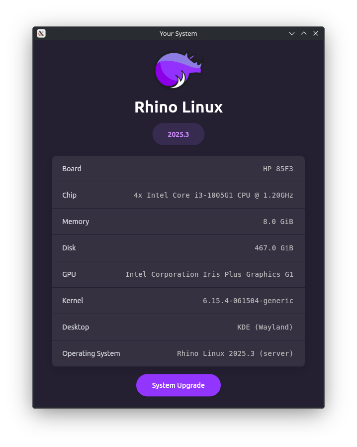

# What is this?
An elegant (cursed) rewrite of Rhino Linux's [rhino-system](https://github.com/rhino-linux/rhino-system) utility in [flet.](flet.dev)



# Why?
The original application is not responsive to different screen sizes, the window doesn't even scale, my rewrite addresses these responsiveness issues, it also uses a new backend.

# Works?
Yes, it's a complete, fully-functional rewrite.

# Building 
#### Using pyinstaller causes some runtime issues, don't use that.

1.  **Clone the repository:**
    ```bash
    git clone https://github.com/IMYdev/rhino-system-ng
    cd rhino-system-ng
    ```

2.  **Set up a virtual environment (recommended):**
    ```bash
    python3 -m venv .venv
    source .venv/bin/activate
    ```

3.  **Install the dependencies:**
    ```bash
    pip3 install -r requirements.txt
    ```
4.  **To build the application:**
    ```bash
    flet build linux
    ```
***Note that the whole build/linux folder IS the build, not just the small executable in there, so when shipping a build, ship that whole directory's contents.***

# Contributing

Contributions are welcome! bug fixes, and/or improvements are truly appreciated.

# Credits
- Rhino Linux [developers](https://discord.gg/jJxAh9Dt) for [Rhino Linux](https://rhinolinux.org/).

## 📄 License

This project is open-source and available under the GPLv3 copyleft.